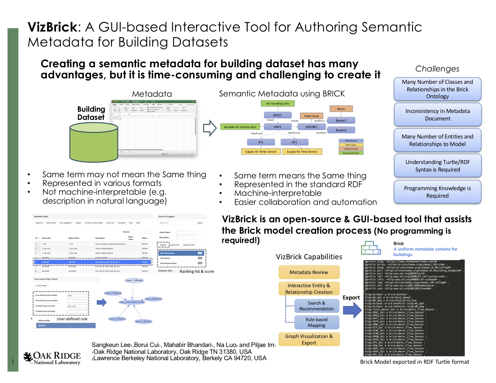

# Tutorial: How to create a Brick model for a building dataset using VizBrick

# Introduction

**VizBrick** (https://github.com/liza183/vizbrick) is a web-based tool with a graphical user interface that helps users to create Brick models (https://brickschema.org/) for their building datasets more easily in an interactive way, without having to know the detailed syntax of RDF TTL(Terse RDF Triple Language) that is used to describe Brick models. In this tutorial, we explain how to create a Brick model using **VizBrick** with the *Ecobee* building dataset (https://bbd.labworks.org/ds/bbd/ecobee).

# Demo Video (For ISWC'22 demo paper submission)

Click the following image to see the VizBrick demonstration video on YouTube:

# How to run using Docker

Run
    docker-compose build
    docker-compose up

Then, open any web browser and go to ``http://localhost:8088/` . If you see the following interface, now, you’re ready to use the VizBrick.

# Installation & how to run

VizBrick requires Python version 3.X, and using Anaconda is recommended. Please download Anaconda from [https://www.anaconda.com/download/](https://www.anaconda.com/download/) and install it first.

Once you installed Anaconda (with Python 3.X), clone the repository by doing

    git clone https://github.com/liza183/vizbrick

Go to the VizBrick directory and create a new Anaconda/Python environment for VizBrick by doing:

    conda env create -f environment.yml --name vizbrick

Please refer to the environent.yml for dependencies.

To activate an environment:

- On Windows, in your Anaconda Prompt, run
    activate vizbrick
- On macOS and Linux, in your Terminal Window, run
    conda activate vizbrick

You will see the active environment in parentheses at the beginning of your command prompt:

    (vizbrick) $

You need to run two Python scripts to start up the VizBrick. Please go to the data_API folder and run the following command:

    (vizbrick) slzmacbookpro:data_API slz$ python api_server.py 
    * Loading Done

The VizBrick API server is now up and running. Then, we need to start up the web server. Go to the web_interface folder and run the following command: 

    (base) slzmacbookpro:web_interface slz$ python ui_server_test.py 
    
    # Web Server started .. now listening port 8088 ..

Then, open any web browser and go to ``http://localhost:8088/` . If you see the following interface, now, you’re ready to use the VizBrick.

# Example: Creating a Brick model for a Ecobee dataset using VizBrick

To demonstrate how a Brick model can be created using VizBrick for a real-world building dataset, we explain the steps to create a Brick model for the Ecobee dataset. Ecobee dataset is a building dataset and it has 26 data points.

## 1. Preparation of a metadata in a CSV file

The first step to creating a Brick model is to prepare a metadata CSV (comma-separated values) file that contains the list of data labels (data points) and their description.

The structure of the metadata file required by VizBrick is very simple. The first column is for the row number index. The second column (Data Label) contains the name of the data label (data point) and the last column contains the description of the corresponding data label in natural language or keywords. We created Table 1 for the Ecobee dataset using spreadsheet software and saved it as a CSV file named ecobee.csv. 

| **Index** | **Data Label**              | **Description**                                 |
| --------- | --------------------------- | ----------------------------------------------- |
| 0         | T_ctrl                      | Indoor averaged measured temperature            |
| 1         | T_stp_cool                  | Indoor cooling setpoint                         |
| 2         | T_stp_heat                  | Indoor heating setpoint                         |
| 3         | Humidity                    | Indoor humidity                                 |
| …         | …                           | Run time for other heat source 1                |
| 22        | Remote_Sensor_5_Temperature | Measured temperature at remote sensor 5         |
| 23        | Remote_Sensor_5_Motion      | Detected motion at remote sensor 5              |
| 24        | T_out                       | Outdoor temperature for nearest weather station |
| 25        | RH_out                      | Outdoor humidity for nearest weather station    |

The CSV file will look like the following:

    Index,Data Label,Description
    0,T_ctrl,Indoor averaged measured temperature
    1,T_stp_cool,Indoor cooling setpoint
    2,T_stp_heat,Indoor heating setpoint
    3,Humidity,Indoor humidity
    4,auxHeat1,Run time for other heat source 1
    5,auxHeat2,Run time for other heat source 2
    6,auxHeat3,Run time for other heat source 3
    ...

Note that the list of data labels and their descriptions are often provided by the personnel or organizations that collected the data. Such information can be used for these steps. There is no specific syntax or requirement for the data label and description values, however, VizBrick will later use the patterns of terms and keywords that show up in both the data label and description for Brick class matching and search. Thus, using more descriptive and semantically clear terms with consistent rules is strongly recommended. For instance, the data label name ‘Humidity’ is better than ‘h1’. Naming the data labels starting with ‘T_’ for temperature sensors is recommended rather than randomly naming them.

When the CSV file is ready. Open a web browser window and load the CSV file by clicking the ‘Load (Start from Scratch)’ button to load the file with VizBrick.

When the metadata is successfully loaded by VizBrick. You will see the metadata table loaded. Each row represents a data point in the dataset. By default, object names are assigned to be the same as the data label names.

## 2. Mapping Brick classes to data points

Next, we will find and assign best matching Brick classes for data points from the Brick ontology. VizBrick provides a suggestion capability. When you select multiple rows from the table and click the ‘Auto-suggestion button on top of the metadata table, VizBrick will iterate each selected row in the metadata table and automatically find the most appropriate Brick class for each data label based on keywords included in the data label and the description. Depending on the number of selected rows, the suggestion can take a few minutes or more depending on the number of data labels in the metadata table. Figure 4 shows the result of the suggestion when auto-suggestion was performed all rows in the table.

Although VizBrick can suggest Brick classes automatically, the accuracy of this automatic matching largely depends on the quality of the data label and description. Thus, we need to manually confirm if these suggestions were correct. For instance, VizBrick thinks that the best matching Brick class for the data label ‘T_stp_cool’ and ‘T_stp_heat’ are ‘Cooling Temperature Setpoint’ and ‘Heating Temperature Setpoint’ respectively, which is correct. Matchings for ‘Humidity’ and ‘auxHeat1’ are correct. However, the most appropriate Brick class for the data label ‘T_ctrl’ should be ‘Average Zone Air Temperature Sensor’ not the ‘Temperature Setpoint’. In this case. we need to correct the matching.

What we will do is to get another suggestion give more hints to VizBrick and select manually from the result. Select the row with ID 0 (the row for T_ctrl) and type ‘Agerage’ in the search bar in the Search & Suggest panel. If you click ‘Search’ then only the keywords in the search bar will be used, however, if you click ‘Suggest’, the data label name and the data description will be used together to find classes in the Brick Ontology. 

Rank 1 from the list was ‘Average Zone Air Temperature Sensor’ which we think is correct, so we select and click ‘Update Row’. 

There may be rows that were not included in the original CSV file. In such case, a new row in the metadata table can be added by clicking a ‘Add a row’ button and the row can be updated. For instance, rows, which are not data points, representings locations, equipments, and other things that can be added. Let us create a row representing a HVAC zone. First, click the ‘Add a row’ button, then typing in ‘hvac_zone’ in the object field field. Then, search with keywords ‘hvac zone’ and select ‘HVAC Zone’ from the result. Then, clicking ‘Update row’ button will update a selected row, in this case, the newly created row.

    Just like we created the ‘hvac_zone’ row, we created other entities such as outside, rooms, and hvac_system. How many additional rows and what rows should be created depend on the dataset and user’s knowledge about the dataset. It is recommended to be descriptive, but not unnecessarily complex. Once the all rows (i.e., Location, Equipment, and Point) that we want to represent in our Brick model are included in the metadata table and they are properly mapped to Brick classes. Now it is time to convert those rows into Brick objects (nodes/vertices). How to do that is simply selecting rows in the metadata table and clicking the ‘Convert to Brick Object’ button. Figure 6 shows an example of the Brick object table after the conversion.

## 3. Creating Brick relationships across entities

In the previous step, we created Brick objects, where they are nodes in the Brick model. The next thing, we need to do is to describe the relationships across them. One way of creating relationships is using the Rule-based Edge Creator panel. For instance, we know that the room_1, room_2, …, and room_5 are parts of the hvac_zone, so we need to create edges between all the pairs with the Brick relationship type ‘isPartOf’. So we type in ‘room’ to be the value of the form ‘From Node (must include)’ and ‘hvac_zone’ in the form ‘To Node (must include)’. Then, we click ‘Create Edges’. This means that we want to create edges between any entities that contain the keyword ‘room’ in their data labels or descriptions to any entities that contain ‘hvac_zone’ in their data labels or descriptions.

If edges between specific a specific Brick object and other nodes need to be created, a user can use a Brick Edge Creator panel. By selecting a *From* object and a *To* object (or objects) in the brick object table and clicking ‘From’ or ‘To’ button in the edge creator panel, we set up what objects to be connected. Next is to select a relationship type and click ‘Create’ button. Figure 10 shows an example.

Relationships across entities are represented as directional edges on the canvas. Depending on the complexity of the model that is being created, intermediate results may need to be created. Progress can be saved by clicking the ‘Save Checkpoint’ button and the file name can be given by the user. Loading the progress can be done similarly, but it needs to be carefully done as loading from a file can override your current progress.

Creating relationships requires many iterative processes of choosing things to connect with and assigning proper relationship types. Created relationships between objects are added in the relationship table and they can be visualized by clicking the ‘Add to Graph’. Further modification of creating and/or removing nodes and edges is possible.

Figurere 14 shows the final result visualized in the canvas after a few iterations of creating relationships. The result can be saved as a TTL file by simply clicking the ‘Save Brick button'

The following file shows the first few lines of the created ttl file. 

    @prefix bldg: <https://url_of_this_data#> .
    @prefix brick: <https://brickschema.org/schema/1.1/Brick#> .
    @prefix btag: <https://brickschema.org/schema/1.0.2/BrickTag#> .
    @prefix gtc: <https://brickschema.org/schema/1.0.2/building_example#> .
    @prefix owl: <http://www.w3.org/2002/07/owl#> .
    @prefix rdf: <http://www.w3.org/1999/02/22-rdf-syntax-ns#> .
    @prefix rdfs: <http://www.w3.org/2000/01/rdf-schema#> .
    @prefix tag: <https://brickschema.org/schema/1.1/BrickTag#> .
    @prefix xml: <http://www.w3.org/XML/1998/namespace> .
    @prefix xsd: <http://www.w3.org/2001/XMLSchema#> .
    
    bldg:auxHeat1 a brick:Run_Time_Sensor .
    bldg:auxHeat2 a brick:Run_Time_Sensor .
    bldg:auxHeat3 a brick:Run_Time_Sensor .
    bldg:compCool1 a brick:Run_Time_Sensor .
    bldg:compCool2 a brick:Run_Time_Sensor .
    bldg:compHeat1 a brick:Run_Time_Sensor .
    bldg:compHeat2 a brick:Run_Time_Sensor .
    bldg:fan a brick:Run_Time_Sensor .
    bldg:Humidity a brick:Humidity_Sensor .
    bldg:hvac_system a brick:HVAC_System .
    bldg:hvac_zone a brick:HVAC_Zone .
    bldg:outside a brick:Outside .
    ...

## 4. Finalization of the created Brick model

The first line needs to be manually updated to assign a proper url for this Brick model. It is also very important to validate the create ttl file using a RDF validator tool such as RDF Validator (https://www.w3.org/2015/03/ShExValidata/).  Also, visualizing the created Brick model file with another visualization tool such as Brick TTL Viewer (https://viewer.brickschema.org/) is very helpful to check if the final outcome is created as expected correctly.

# Conclusions

VizBrick enables creating Brick models for building datasets without having to program or understand the syntax of RDF language or details of Brick ontology. The tool provides several assist capabilities such as Brick class suggestion, rule-based mapping, interactive manipulation of the network, and visualization. In this document, we demonstrated how to install, run, and use VizBrick to create a Brick model for building a dataset. We chose Ecobee dataset as our example dataset and explained every step of the process. 

